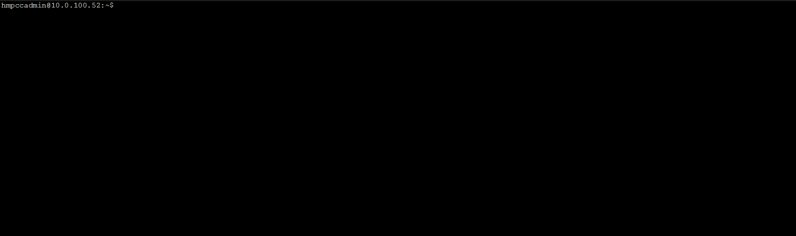

## Instructions
To save your machine to a Docker Image follow these steps. Docker will need to be installed on the machine prior to running these
examples. Instructions for installing Docker can be found in the prerequisite section at the end of this document. Aim to keep only 
what is necessary in your image, shoot for 1GB or less, and avoid saving any stateful data directly to the image.

**STEP 1**:  Navigate to the root of the server: *$ cd /*

**STEP 2**: Next move a copy of each file also to root: *.dockerignore, Dockerfile* and *startup.sh*. Starup.sh is optional, and should
be included if you need to make additional configurations to your image while it starts up. 

**STEP 3**: To build the image run the following, using your specific repo and tags:

```bash
$ docker build -t your_repo/your_project:your_tag .
```

Do not forget "." period, this tells the docker daemon to run the Dockerfile from the current location. 
If you run into issues you can manually specify the location of the dockerfile:

```bash
$ docker build -t my_vm:latest - < /Dockerfile
```

**STEP 4**: Save your image or push it to a central repository. 

* To push to a repo:
```bash
$ docker push your_repo/your_project:your_tag  
//Note, you'll need to sign into your specific repo if using a remote repository.
```

* To save to tar:
```bash
$ docker save <image> > somefile.tar
or
$ docker save myimage > /media/some/remote/mount/myimage_20190603.tar
```

**STEP 5**: To get the image back into another VM for building run either:
```bash
$ docker pull my/repo:mytag   --To making use of a repository
$ docker load < myimage.tar   --To making use of image saved to tar. 
```


## Contents
**Dockerfile** - This describes what base image to build and which files to load into the image. 

**.dockerignore** - Any files, directories or programs that should be excluded. Any data that needs to persist when the container
is killed should live inside a stateful data set like a persistent volume. 

## Prerequisites
Note avoid installing docker with snap, current known bug which can prevent building from the root directory. https://docs.docker.com/install/

To install run the following commands:
```bash
$ sudo apt-get update*
$ sudo apt install docker.io*
$ sudo systemctl start docker*
$ sudo systemctl enable docker*  This allows docker to start on reboots
```

To run docker as non-root user add the docker executable to the environmental file path location. 
For example: 
* *$ export PATH=$PATH:/var/lib/docker .* 
The general schema for setting environmental variables for where the computer will look for 
the executable is:  *$ export PATH=$PATH:/location/of/executable*


